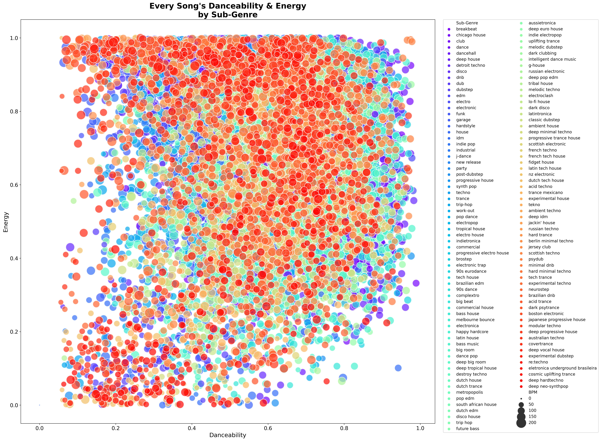

# *Live DJ Assist: Using Spotify to Build a Recommendation System for DJ'ing Electronic Dance Music*
Author: [Paul Lindquist](https://www.linkedin.com/in/paul-lindquist/)

## Background
Electronic dance music is overwhelmingly created with computers and plugins rather than instruments and live recordings. It's typically distributed digitally, opting for high-quality .wav, .aiff and .mp3 files over CDs and vinyl. As such, thousands of new songs are released every day. This presents a challenge for any DJ or music curator seeking to keep their library current without drowning in new releases. To complicate matters further, the music isn't centralized. Releases are sold on numerous online stores like [Beatport](https://www.beatport.com/), [Juno Download](https://www.junodownload.com/), [Traxsource](https://www.traxsource.com/) and [Bandcamp](https://bandcamp.com/) or given away for free on platforms like [Soundcloud](https://soundcloud.com/). Crate digging has long since moved to the digital space and it's easy to get overwhelmed.

Like any other genre of music, electronic dance music has historically been categorized by sub-genres. Generally, they were defined by features like tempo (beats per minute/BPM), mood and the instrument samples used. Orchestral strings weren't heavily utilized in Jungle music, Trance rarely dipped below 122 beats per minute, etc. But as the music evolved and artists implemented elements from different sub-genres, classifying songs became both cumbersome and antiquated. There needed to be a new way to analyze songs irrespective of sub-genres and by the early 2010s, there was a leader in that space.

Spotify acquired music intelligence and data platform *The Echo Nest* in 2014. Shortly thereafter, they began integrating *TEN*'s algorithm-based audio analysis and tagging songs with audio features such as valence, energy, tempo, etc. Through their [Web API](https://developer.spotify.com/documentation/web-api/), Spotify began permitting the extraction of these features when calling songs to build out datasets. Along with the tagged sub-genres, this allowed for a more detailed categorization and comparison of songs.

## Overview
This project leveraged those features and focused solely on electronic dance music within Spotify's database. Common sub-genres categorized by both [Every Noise at Once](https://everynoise.com/) and Spotify's own [genre seeds](https://developer.spotify.com/console/get-available-genre-seeds/) within their [recommendation API](https://developer.spotify.com/documentation/web-api/reference/#/operations/get-recommendations) were used to narrow the final dataset.

Spotify was chosen as the singular data-gathering platform for a few reasons:
1. It's the world's most popular music streaming service with a database of over 70 million songs
2. The algorithm-based audio analysis (song features) provided unmatched opportunity for song comparison and recommendation
3. Their [Web API](https://developer.spotify.com/documentation/web-api/) is accessible and well-documented
4. Songs are tagged with identifiers like ID and URI for organized tracking

The following Spotify audio features were extracted and used as features for determining similarity for recommendation. Refer to the [documentation](https://developer.spotify.com/documentation/web-api/reference/#/operations/get-several-audio-features) for an in-depth explanation of each:
- Acousticness, danceability, energy, instrumentalness, liveness, loudness, speechiness, tempo (BPM), valence

Musical features like key and mode were purposefully omitted because there are separate third-party applications (e.g. [Mixed in Key](https://mixedinkey.com/)) that can hard-tag songs with that information. Many DJs do this and will already have it available during song selection. Also, and perhaps more importantly, making recommendations based on a song's key can lead to a string of songs that sound too familiar. Over time, this tends to lead to a tired listening experience.

## Business Objective
This project set out to make a recommendation system for electronic dance music, specifically with live DJ'ing in mind. It should assist DJs with tracklist preparation or live DJ performance. Often only 1 song is needed to fill out a set, or create a bridge between 2 songs or inspire a line of thinking that allows the DJ to come up with the next song on their own. This recommendation system can assist that process.

Sometimes a DJ wants variety and would like to play a song that's categorized by a different sub-genre than the song currently being played. The final model function gives the option to provide recommendations within the same genre or across all genres.

I served as my own stakeholder for this project. Personal domain knowledge was used to determine validity of the recommendations. I've DJ'ed electronic dance music for 13 years and have played countless live mixes. From 2013-2019, I co-founded, operated and resident DJ'ed an [electronic music podcast](https://podcasts.apple.com/us/podcast/electric-retox-electronic-music-podcast/id733126312), amassing over 72,000 subscribers. As a casual listener, I've been a fan of the genre since the 90s.

## Data
Data was aggregated from multiple sources:
- API calls of Spotify's [Web API](https://developer.spotify.com/documentation/web-api/) using their [genre seeds](https://developer.spotify.com/console/get-available-genre-seeds/)
- A [raw dataset](https://www.kaggle.com/nikitricky/every-noise-at-once?select=songs.csv) of approx. 500k songs referencing [Every Noise at Once](https://everynoise.com/)'s *[The Sound of Everything](https://open.spotify.com/playlist/69fEt9DN5r4JQATi52sRtq)* Spotify playlist
- [Multiple](https://www.kaggle.com/christinobarbosa/spotify-dataset?select=Spotify_dataset.csv) [Kaggle datasets](https://www.kaggle.com/vatsalmavani/spotify-dataset?select=data) that contained necessary genre tagging and audio feature listings (energy, danceability, etc.)

## Methods
This project exclusively used content-based filtering to build a recommendation system. Similarity was calculated using K-Nearest Neighbors (KNN), cosine similarity and sigmoid kernel. Exploratory data analysis and visualizations were conducted on the final, cleaned data.

## Results
The final dataset had just under 23,000 songs spanning 128 sub-genres. Filtering by the energy and danceability audio features, it comes as no surprise that the majority of songs within the dataset 



Let's take a look...
https://user-images.githubusercontent.com/92393233/150712875-9bf73962-4419-415d-a124-42f7972f3ad4.mp4


## Conclusions
TBD

## Limitations
TBD

## Next Steps
TBD

## For More Information
Please review the full analysis in my Jupyter Notebook or presentation deck.

For additional questions, feel free to [contact me](https://www.linkedin.com/in/paul-lindquist/).

## Respository Structure
```
├── data                                <- Source data .csv files
├── images                              <- Exported Notebook visualizations
├── README.md                           <- The top-level README for reviewers of this project
├── main_notebook.ipynb                 <- Technical and narrative documentation in Jupyter Notebook
└── project_presentation.pdf            <- PDF version of project presentation
```
