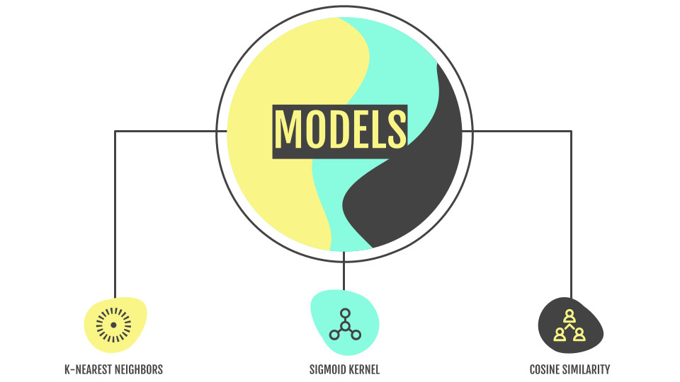

# *Live DJ Assist: Using Spotify to Build a Recommendation System for DJ'ing Electronic Dance Music*
Author: [Paul Lindquist](https://www.linkedin.com/in/paul-lindquist/)

## Background
Electronic dance music is overwhelmingly created with computers and plugins rather than instruments and live recordings. It's typically distributed digitally, opting for high-quality .wav, .aiff and .mp3 files over CDs and vinyl. As such, thousands of new songs are released every day. This presents a challenge for any DJ or music curator seeking to keep their library current without drowning in new releases. To complicate matters further, the music isn't centralized. Releases are sold on numerous online stores like [Beatport](https://www.beatport.com/), [Juno Download](https://www.junodownload.com/), [Traxsource](https://www.traxsource.com/) and [Bandcamp](https://bandcamp.com/) or given away for free on platforms like [Soundcloud](https://soundcloud.com/). Crate digging has long since moved to the digital space and it's easy to get overwhelmed.

Like any other genre of music, electronic dance music has historically been categorized by sub-genres. Generally, those sub-genres are defined by features like tempo (beats per minute/BPM), mood and the types of instrument samples used. Orchestral strings aren't heavily utilized in Jungle music, Trance rarely dips below 122 beats per minute, etc. But as the music has evolved and artists implement elements from different sub-genres, classifying songs by sub-genre has become both cumbersome and antiquated. There needs to be a more efficient way to analyze songs irrespective of sub-genres. By the early 2010s, a leader emerged in that space.

Spotify acquired that leader, music intelligence and data platform *The Echo Nest*, in 2014. Shortly thereafter, they began integrating *TEN*'s algorithm-based audio analysis and tagging songs with audio features such as valence, energy, danceability, etc. Through their [Web API](https://developer.spotify.com/documentation/web-api/), Spotify began permitting the extraction of these features when building out datasets. Along with the additionally tagged sub-genres, this allows for a more detailed categorization and comparison of songs.

## Overview
This project leverages those audio features and focuses solely on electronic dance music within Spotify's database. Common sub-genres categorized by both [Every Noise at Once](https://everynoise.com/) and Spotify's own [genre seeds](https://developer.spotify.com/console/get-available-genre-seeds/) are used to narrow the final dataset.

Spotify is chosen as the singular data-gathering platform for a few reasons:
1. It's the world's most popular music streaming service with a database of over 70 million songs
2. The algorithm-based audio analysis (song features) provides unmatched opportunity for song comparison and recommendation
3. Their [Web API](https://developer.spotify.com/documentation/web-api/) is accessible and well-documented
4. Songs are tagged with identifiers like ID and URI for organized tracking

The following Spotify audio features are extracted and used as features for determining similarity for recommendation. Refer to the [documentation](https://developer.spotify.com/documentation/web-api/reference/#/operations/get-several-audio-features) for an in-depth explanation of each:
- Acousticness, danceability, energy, instrumentalness, liveness, loudness, speechiness, tempo (BPM), valence

Musical features like key and mode are purposefully omitted because there are separate third-party applications (e.g. [Mixed in Key](https://mixedinkey.com/)) that can hard-tag songs with that information. Many DJs do this and will already have it available during song selection. Also, and perhaps more importantly, making recommendations based on a song's key can lead to a string of songs that sound too familiar. Over time, this tends to create a tired listening experience.

## Business Objective
This project set out to make a recommendation system for electronic dance music, specifically with live DJ'ing in mind. It can assist DJs with tracklist preparation or live DJ performance. Often only 1 song is needed to fill out a set, create a bridge between 2 songs or inspire a line of thinking that allows the DJ to come up with the next song on their own. This recommendation system can assist that process.

Sometimes a DJ wants variety and would like to play a song that's categorized by a different sub-genre than the song currently being played. The final model function gives the option to provide recommendations within the same sub-genre or across all sub-genres.

I serve as my own stakeholder for this project. Personal domain knowledge is used to determine validity of the recommendations. I've DJ'ed electronic dance music for 13 years and have played countless live mixes. From 2013-2019, I co-founded, operated and resident DJ'ed an [electronic music podcast](https://podcasts.apple.com/us/podcast/electric-retox-electronic-music-podcast/id733126312), amassing over 72,000 subscribers. As a casual listener, I've been a fan of the genre since the 90s.

## Data
Data is aggregated from multiple sources:
- API calls of Spotify's [Web API](https://developer.spotify.com/documentation/web-api/) using their [genre seeds](https://developer.spotify.com/console/get-available-genre-seeds/)
- A [raw dataset](https://www.kaggle.com/nikitricky/every-noise-at-once?select=songs.csv) of approx. 500k songs referencing [Every Noise at Once](https://everynoise.com/)'s *[The Sound of Everything](https://open.spotify.com/playlist/69fEt9DN5r4JQATi52sRtq)* Spotify playlist
- [Multiple](https://www.kaggle.com/christinobarbosa/spotify-dataset?select=Spotify_dataset.csv) [Kaggle datasets](https://www.kaggle.com/vatsalmavani/spotify-dataset?select=data) that contained necessary sub-genre tagging and audio feature listings (energy, danceability, etc.)

## Methods
This project exclusively uses content-based filtering to build a recommendation system. Similarity is calculated using K-Nearest Neighbors (KNN), cosine similarity and sigmoid kernel. Exploratory data analysis and visualizations are conducted on the final, cleaned data.

## Results

### The Dataset
The final dataset has just under 23,000 songs spanning 128 sub-genres. It comes as no surprise that the majority of songs within the dataset score high in both energy and danceability. Both features somewhat define electronic dance music.


### Modeling
Recommendations are made by testing 8 different modeling algorithms and functions, all similarity and distance-based. Cosine similarity and K-Nearest Neighbors yield the most consistent results while the sigmoid kernel provides some valid recommendations with a bit of variety. The remaining 5 kernel functions (x², linear, polynomial, etc.) do not produce many varying recommendations from those of cosine similarity of sigmoid kernel so they aren't used in the final model function.



While the scores of each algorithm or function are used to create the "mathematically most similar" recommendations, what really matters is how the songs sound when compared to the provided reference song. As such, the results are somewhat subjective.

### The Recommendations
***Please note:*** *In the video comparisons below, the reference song is repeatedly played before each recommendation. This is so the ear can make a direct comparison with the reference song rather than the other recommendations. After all, live DJ's are only looking for a next-song recommendation while another song is currently playing.*

1. The first recommended song is so similar to the reference that DJ's have made mashups of the 2 songs. From the similar instrumentation to the nearly-identical syncopated arpeggio, everything about this recommendation is spot-on.
2. The second recommended song captures the essence and energy of the reference while not sounding the exact same.
3. Interestingly, the third recommendation is a song from the same artist released in the same year as the reference. Release year and artist are not a part of the modeled data so the similarity is being identified within the audio features.

https://user-images.githubusercontent.com/92393233/150801538-f8de7952-568c-4539-a5c9-7e9a8cc540dc.mp4

A bit of a different approach is used for this next batch of recommendations. To test robustness, the final model function is input to recommend songs across all genres. Notice the reference song has a piano-heavy, Disco-infused-almost-throwback feel to it. Its energy is upbeat and its valence is positive.
1. The first recommendation carries that same positivity and upbeat energy. Like the reference song, it also has vocals and a Disco-heavy bassline.
2. The second recommendation sounds the most dissimilar of all the recommendations. It has a few filtered instrumentation elements like the reference song but it's hard to describe its energy as upbeat or its valence as positive.
3. The third recommendation also comes from quite a different sub-genre but its sound is energetic, positive and it too features vocals. It would be a nice change of pace from the reference song without sounding like there was no connection.

https://user-images.githubusercontent.com/92393233/150801555-a05639d5-7298-4dbc-bd3b-49914cdb5398.mp4

## Conclusions
The recommendation system is quite good. It's able to provide a variety of recommendations that include both songs with exactness in sound and songs with similar energy, danceability and valence. Given the number of results within the scope of the provided reference song, there's a strong likelihood a DJ would be able to select a song from the list of recommendations. Remember, it only takes 1 usable song for the recommendation system to successfully achieve its objective.

## Limitations
There are a few limitations encountered over the course of this project:
1. The data relies heavily on the original tagging of audio features and sub-genre for making recommendations. If, for whatever reason, a song's sub-genre, danceability, etc. wasn't initially tagged properly, the recommendations will reflect those deficiencies.
2. The final dataset only includes just under 23,000 songs. This is likely a severe underrepresentation of electronic dance music from Spotify's 70 million song database.
3. The final dataset is also static, in that it includes data from other raw datasets and isn't exclusively derived from Spotify API calls. Over time, the data will become outdated and new releases won't be represented in the data, both for reference and recommendation.
4. Recommendations for sub-genres like Tech House and Techno, where audio features vary and songs are harder to classify, aren't very strong. It's unsurprising given the ambiguity of the sub-genres' features but it still yields weaker recommendations.

## Next Steps
Should this project be continued, the following next steps should be explored:
1. Expanding the data through additional Spotify API calls
2. Deploying the final model function to a mobile app, or at least a mobile-responsive application like [Streamlit](https://streamlit.io/), so DJ's can access recommendations on their phones while mixing
3. Building a new dataset, through API calls or web scraping, using an electronic music-specific store like [Beatport](https://www.beatport.com/), [Juno Download](https://www.junodownload.com/), [Traxsource](https://www.traxsource.com/), etc.

## For More Information
Please review the full analysis in my [Jupyter Notebook](./main_notebook.ipynb) or [presentation deck](./project_presentation.pdf).

For additional questions, feel free to [contact me](https://www.linkedin.com/in/paul-lindquist/).

## Respository Structure
```
├── data                                <- Source data .csv files
├── images                              <- Exported Notebook visualizations
├── README.md                           <- The top-level README for reviewers of this project
├── main_notebook.ipynb                 <- Technical and narrative documentation in Jupyter Notebook
├── spotify_authorization.py            <- Spotify authorization function to call in Main Notebook
└── project_presentation.pdf            <- PDF version of project presentation
```
